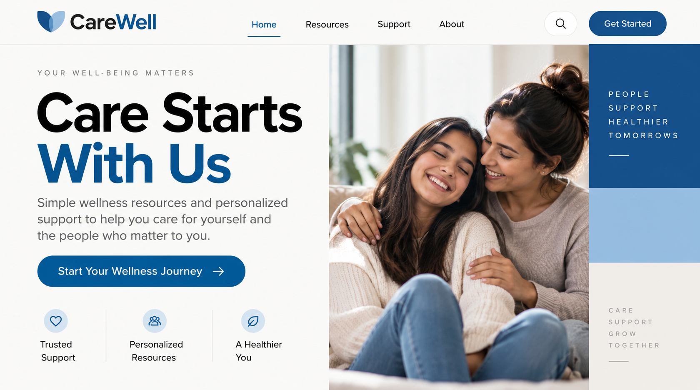
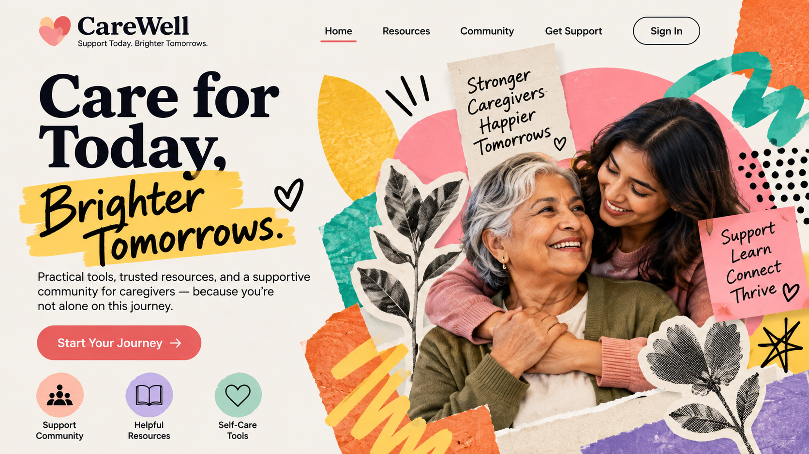

# Caregiver

[Home](../README.md)

## Motivation and cues

The Caregiver archetype focuses on helping, protecting, supporting, and caring for others. Its audience is often motivated by safety, comfort, trust, compassion, and the feeling that someone understands their needs.

Visual choices for the Caregiver can include warm and welcoming imagery, people helping or supporting one another, soft or calming colors, clear typography, and layouts that feel safe and easy to understand. Verbal cues can include words such as care, support, together, protect, help, and trust.

The Caregiver archetype works well for brands and organizations connected to healthcare, education, charities, family services, personal care, and other products or services designed to improve people's well-being.

### Real brand example

**Brand:** Johnson & Johnson

Johnson & Johnson can be interpreted through the Caregiver archetype because its brand communication emphasizes health, care, and improving people's well-being. These ideas connect with the Caregiver's focus on helping and protecting others.

**Direct source:** [Johnson & Johnson](https://www.jnj.com/)

**My interpretation:** I would adapt this Caregiver approach by using supportive imagery, reassuring language, and an easy-to-understand layout. The design should make the audience feel that the brand is dependable and focused on helping people.

## Brief

**Audience:** People looking for a trustworthy product or service that supports their health and well-being.

**Product:** A fictional wellness and self-care service.

**Core offer:** Simple resources and personalized support that help people take better care of themselves.

**Action:** Encourage visitors to explore the wellness service and begin using its support resources.

**Modernist style:** International Style

**Postmodernist style:** Postmodern Eclecticism

**Persuasion principle:** Unity

## Hero 1: Modernist / Unity

This hero uses the Caregiver archetype through supportive wellness imagery, reassuring language, and a calm, organized presentation. The International Style is reflected through the clean layout, clear visual hierarchy, simple typography, and structured placement of information. The persuasion principle of Unity is used by keeping the visual elements consistent and connected, helping the design feel trustworthy and supportive.

## Hero 2: Postmodernist / Unity

This hero uses the Caregiver archetype through warm, supportive imagery and reassuring wellness messaging. The Postmodern Eclecticism style is reflected through a more expressive composition, bold visual elements, varied shapes, and a less structured arrangement. The persuasion principle of Unity connects the different visual elements so the design still feels consistent and focused on care and support.

## Comparison

Both hero designs communicate the Caregiver archetype through supportive imagery, reassuring language, and a focus on wellness. The modernist version uses the International Style, making the design feel clean, organized, and easy to understand. The postmodernist version uses Postmodern Eclecticism, making the design more expressive, playful, and visually dynamic.

For this audience, the modernist approach creates a stronger sense of calm and trust because the information is presented clearly with fewer visual distractions. The style changes how the message is presented, while the Caregiver archetype and the persuasion principle of Unity keep both designs focused on support, care, and well-being.

## Process

I created two original hero designs for the Caregiver archetype: one using the International Style and one using Postmodern Eclecticism. I focused on communicating care, support, trust, and well-being while keeping the main message and CTA easy to understand.

For the modernist hero, I used a cleaner and more structured composition with clear hierarchy and organized spacing. For the postmodernist hero, I experimented with a more expressive arrangement, varied visual elements, and a less rigid composition.

During the design process, I revised the layouts to improve readability and make sure the Caregiver message remained clear in both styles. I kept the persuasion principle of Unity in mind by making the text, imagery, and other visual elements work together as one connected design.

## Sources and credits

- [Johnson & Johnson](https://www.jnj.com/) — Caregiver brand reference and inspiration.
- International Style research — See [International Style](../international_style.md)
- Postmodern Eclecticism research — See [Postmodern Eclecticism](../postmodern_eclecticism.md)
- Both Caregiver hero designs are original designs created for this project.
