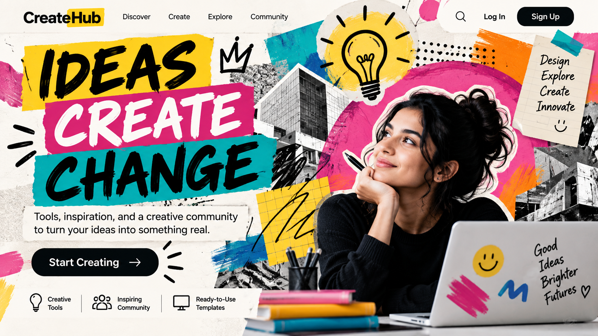

# Creator

[Home](../README.md)

## Motivation and cues

The Creator archetype focuses on creativity, imagination, innovation, originality, and self-expression. Its audience is often motivated by the desire to create something meaningful, express their ideas, explore possibilities, and turn their imagination into reality.

Visual choices for the Creator can include imaginative imagery, expressive layouts, creative typography, artistic elements, and designs that communicate originality and experimentation. Verbal cues can include words such as create, imagine, design, build, express, inspire, and innovate.

The Creator archetype works well for brands and organizations connected to design, technology, art, media, creative tools, and other products or services that help people develop and express their ideas.

### Real brand example

**Brand:** Adobe

Adobe can be interpreted through the Creator archetype because its products provide tools for creativity, design, photography, video, and digital content creation. These ideas connect with the Creator's focus on imagination, originality, creativity, and self-expression.

**Direct source:** [Adobe](https://www.adobe.com/)

**My interpretation:** I would adapt this Creator approach by using imaginative visuals, creative typography, and messaging that encourages people to turn their ideas into something real. The design should make the audience feel inspired to create and express themselves.

## Brief

**Audience:** People who want tools and resources to develop creative ideas and express themselves.

**Product:** A fictional digital creativity platform.

**Core offer:** Creative tools and resources that help people develop ideas, design projects, and turn their imagination into finished work.

**Action:** Encourage visitors to explore the platform and start creating.

**Modernist style:** International Style

**Postmodernist style:** Postmodern Eclecticism

**Persuasion principle:** Unity

## Hero 1: Modernist / Unity

This hero uses the Creator archetype through creative messaging and imagery focused on imagination and making new things. The International Style is reflected through a clean layout, clear visual hierarchy, simple typography, and structured placement of information. The persuasion principle of Unity connects the visual elements and messaging around the shared idea of creativity and self-expression.

## Hero 2: Postmodernist / Unity

This hero uses the Creator archetype through expressive imagery, imaginative messaging, and a more experimental visual presentation. Postmodern Eclecticism is reflected through bold visual elements, varied shapes, playful combinations, and a less structured composition. The persuasion principle of Unity helps connect these different elements around the shared identity of being creative and imaginative.

## Comparison

Both hero designs communicate the Creator archetype through creativity, imagination, originality, and self-expression. The modernist version uses the International Style, making the information feel organized, clear, and controlled. The postmodernist version uses Postmodern Eclecticism, allowing the design to feel more expressive, playful, and experimental.

For this audience, the postmodernist approach allows more freedom for visual experimentation and self-expression, while the modernist approach presents the creative message in a clearer and more structured way. The style changes how the message is presented, while the Creator archetype and the persuasion principle of Unity connect both designs around creativity.

## Process

I created two original hero designs for the Creator archetype: one using the International Style and one using Postmodern Eclecticism. I focused on communicating creativity, imagination, originality, and self-expression while keeping the main message and CTA understandable.

For the modernist hero, I used a cleaner and more structured composition with clear hierarchy and organized spacing. For the postmodernist hero, I used a more expressive arrangement with varied visual elements, shapes, and a less rigid composition.

During the design process, I revised the layouts to improve readability while maintaining the creative personality of the archetype. I used the persuasion principle of Unity by making the messaging and visual elements reinforce a shared identity centered on creativity and imagination.

## Sources and credits

- [Adobe](https://www.adobe.com/) — Creator brand reference and inspiration.
- International Style research — See [International Style](../international_style.md)
- Postmodern Eclecticism research — See [Postmodern Eclecticism](../postmodern_eclecticism.md)
- Both Creator hero designs are original designs created for this project.
