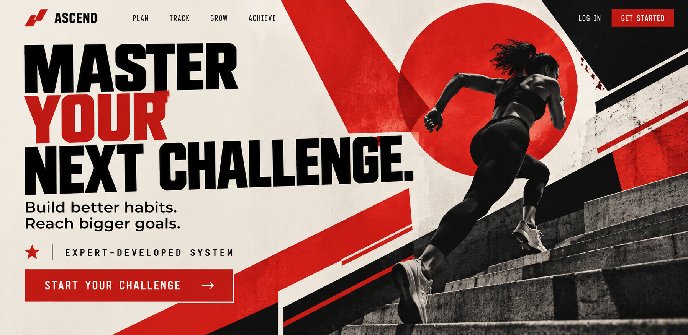

# Hero

[Home](../README.md)

## Motivation and cues

The Hero archetype focuses on courage, achievement, determination, and overcoming challenges. Its audience is often motivated by the desire to improve themselves, accomplish difficult goals, and prove what they are capable of.

Visual choices for the Hero can include bold typography, strong imagery, action-oriented photography, high contrast, and designs that communicate strength and confidence. Verbal cues can include words such as achieve, overcome, conquer, improve, challenge, strength, and succeed.

The Hero archetype works well for brands and organizations connected to sports, fitness, competition, personal development, and other products or services that encourage people to challenge themselves and accomplish a goal.

### Real brand example

**Brand:** Nike

Nike can be interpreted through the Hero archetype because its brand messaging often focuses on achievement, determination, courage, and pushing through challenges. Nike encourages its audience to take action and improve themselves, which connects with the Hero's focus on overcoming obstacles and reaching goals.

**Direct source:** [Nike - Why Do It?](https://about.nike.com/en/newsroom/releases/nike-why-do-it-campaign)

**My interpretation:** I would adapt Nike's Hero approach by using strong imagery, bold typography, and messaging that challenges the audience to take action. The design should make the audience feel motivated and capable of accomplishing something difficult.

## Brief

**Audience:** College students and young adults who want to challenge themselves and achieve their goals.

**Product:** A fictional personal development and goal-tracking platform.

**Core offer:** Tools and resources that help users set challenging goals, track their progress, and stay motivated as they work toward personal achievements.

**Action:** Encourage visitors to join the platform and begin working toward a goal.

**Modernist style:** Constructivism

**Postmodernist style:** New Wave

**Persuasion principles:** Authority

## Hero 1: Constructivism / Authority

This hero uses the Hero archetype through action-oriented imagery and messaging focused on overcoming challenges and achieving goals. Constructivism is reflected through bold typography, geometric shapes, diagonal elements, a limited red, black, and cream color palette, and a strong visual hierarchy. The Authority persuasion principle is represented through the "Expert-Developed System" message, which emphasizes expertise and credibility.

## Comparison

Both hero designs communicate the Hero archetype through determination, achievement, strength, and overcoming challenges. The modernist version uses Constructivism, creating a bold and structured design through geometric shapes, strong diagonals, limited colors, and large typography. The postmodernist version uses New Wave, making the design feel more experimental through layered elements, irregular placement, expressive typography, and brighter colors.

For this audience, Constructivism creates a more direct and powerful message, while New Wave creates a more energetic and expressive experience. Although the visual styles are different, both designs use the Authority persuasion principle to build credibility through the idea of an expert-developed system.

## Process

I created two original hero designs for the Hero archetype: one using Constructivism and one using New Wave. I focused on communicating determination, achievement, personal growth, and overcoming challenges while keeping the main message and CTA easy to understand.

For the Constructivist hero, I used bold typography, geometric shapes, diagonal elements, and a limited red, black, and cream color palette. For the New Wave hero, I used a more experimental composition with overlapping elements, irregular placement, expressive typography, and brighter colors.

During the design process, I made sure both designs maintained the same Hero message while showing the differences between the two styles. I used the Authority persuasion principle through messaging about an expert-developed system to give the fictional platform more credibility.

## Sources and credits

- [Nike](https://about.nike.com/en/newsroom/releases/nike-why-do-it-campaign) — Hero brand reference and inspiration.
- Constructivism research — See [Constructivism](../constructivism.md)
- New Wave research — See [New Wave](../new_wave.md)
- Both Hero designs were created for this project with the assistance of generative AI.