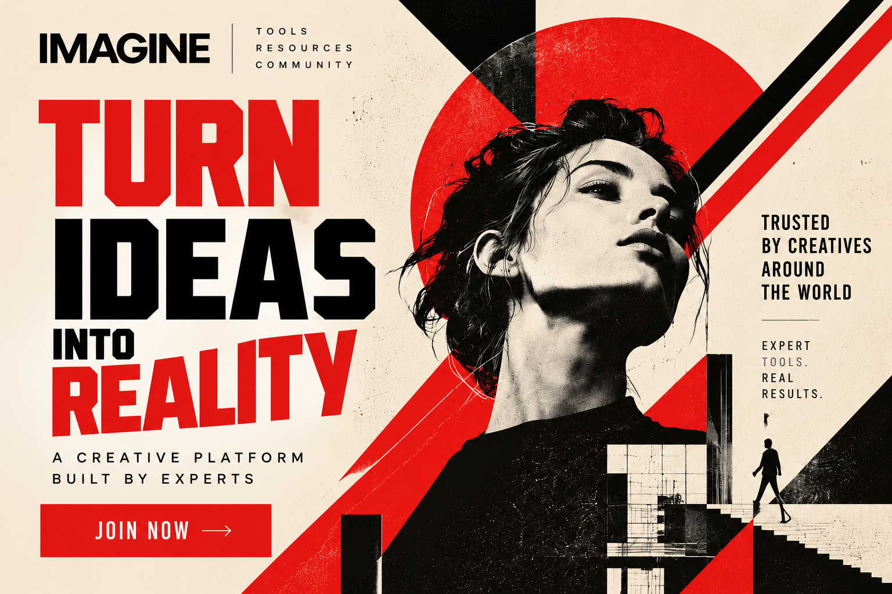
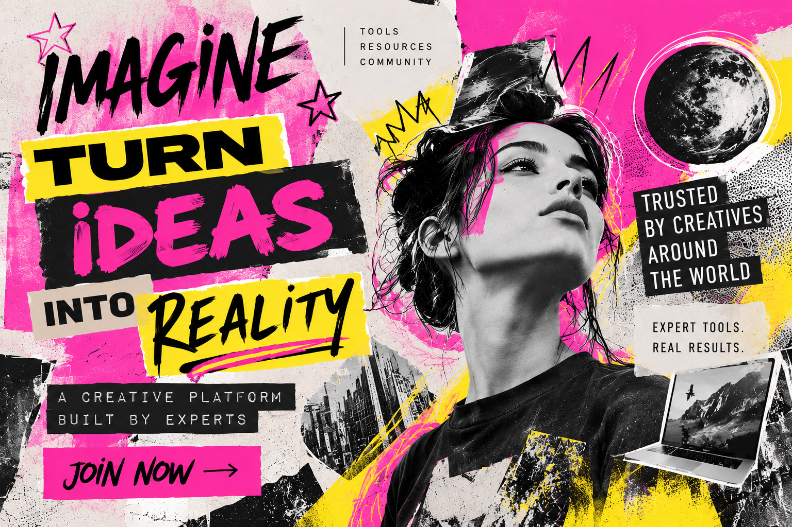

# Magician

[Home](../README.md)

## Motivation and cues

The Magician archetype focuses on transformation, imagination, possibility, and turning ideas into reality. Its audience is often motivated by the desire to create change, experience something extraordinary, or discover possibilities that they may not have thought were possible.

Visual choices for the Magician can include imaginative imagery, dramatic lighting, unusual compositions, transformation-focused visuals, and designs that create a sense of wonder or possibility. Verbal cues can include words such as imagine, transform, create, discover, possibility, extraordinary, and unlock.

The Magician archetype works well for brands and organizations that focus on creativity, innovation, transformation, entertainment, or products that allow people to accomplish something that once seemed difficult or impossible.

### Real brand example

**Brand:** Disney

Disney can be interpreted through the Magician archetype because its brand often focuses on imagination, magical experiences, storytelling, and creating experiences that feel extraordinary. Its emphasis on bringing imagined worlds and experiences to life connects with the Magician's focus on transformation and making possibilities feel real.

**Direct source:** [Disney](https://www.disney.com/)

**My interpretation:** I would adapt this Magician approach through imaginative visuals, transformation-focused messaging, and a design that creates a sense of possibility. The design should make the audience feel like they have the ability to turn their ideas into something real.

## Brief

**Audience:** College students and young creatives who want to turn their ideas into finished creative projects.

**Product:** A fictional creative platform called IMAGINE.

**Core offer:** Expert-developed creative tools and resources that help users transform their ideas into finished projects.

**Action:** Encourage visitors to join the platform and start creating.

**Modernist style:** Constructivism

**Postmodernist style:** New Wave

**Persuasion principle:** Authority

## Hero 1: Modernist / Authority

This hero uses the Magician archetype through transformation-focused messaging and the idea of turning creative ideas into reality. Constructivism is reflected through bold typography, geometric shapes, diagonal elements, strong contrast, and a limited red, black, and cream color palette. The Authority persuasion principle is represented through messaging such as "Built by Experts" and "Trusted by Creatives Around the World," which builds credibility around the platform.

## Hero 2: Postmodernist / Authority

This hero uses the Magician archetype through imaginative visuals and messaging focused on transforming ideas into reality. New Wave is reflected through experimental typography, overlapping elements, irregular placement, collage-style imagery, and bright pink and yellow colors. The Authority persuasion principle is represented through messaging about expert-built tools and being trusted by creatives, which gives the fictional platform more credibility.

## Comparison

Both hero designs communicate the Magician archetype through imagination, transformation, creativity, and turning ideas into reality. The modernist version uses Constructivism, creating a more structured and powerful design through geometric shapes, strong typography, diagonal elements, and a limited color palette. The postmodernist version uses New Wave, making the design feel more experimental and imaginative through expressive typography, overlapping imagery, irregular placement, and brighter colors.

For this audience, Constructivism creates a more direct and confident message, while New Wave creates a more creative and expressive experience. Although the visual styles are different, both designs use Authority to build credibility around the creative platform.

## Process

I created two hero designs for the Magician archetype: one using Constructivism and one using New Wave. I focused on communicating imagination, transformation, creativity, and the ability to turn ideas into reality while maintaining a clear message and CTA.

For the Constructivist hero, I used bold typography, geometric shapes, diagonal elements, and a limited red, black, and cream color palette. For the New Wave hero, I used experimental typography, collage-style imagery, overlapping elements, irregular placement, and brighter colors.

During the design process, I kept the fictional IMAGINE platform and its core message consistent so the differences between the two styles would be clear. I applied Authority through messaging about expert-developed tools and credibility within the creative community.

## Sources and credits

- [Disney](https://www.disney.com/) — Magician brand reference and inspiration.
- Constructivism research — See [Constructivism](../constructivism.md)
- New Wave research — See [New Wave](../new_wave.md)
- Both Magician designs were created for this project with the assistance of generative AI.

