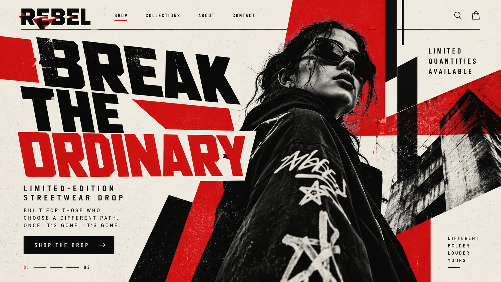
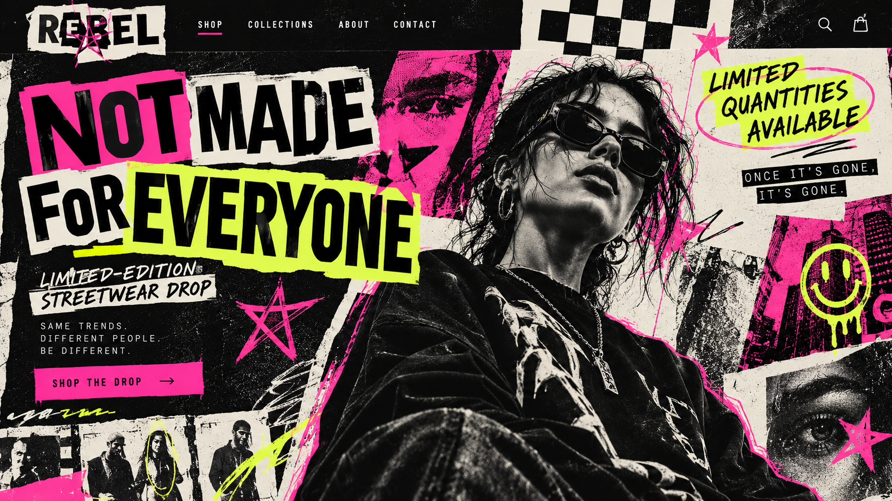

# Outlaw

[Home](../README.md)

## Motivation and cues

The Outlaw archetype focuses on rebellion, freedom, independence, and challenging the status quo. Its audience is often motivated by the desire to break away from expectations, reject traditional rules, and express individuality.

Visual choices for the Outlaw can include bold typography, high contrast, unconventional layouts, rebellious imagery, rough textures, and designs that intentionally challenge traditional visual expectations. Verbal cues can include words such as rebel, break, disrupt, freedom, challenge, different, and fearless.

The Outlaw archetype works well for brands and organizations that want to appear unconventional, disruptive, independent, or willing to challenge established expectations.

### Real brand example

**Brand:** Harley-Davidson

Harley-Davidson can be interpreted through the Outlaw archetype because its brand strongly emphasizes freedom, independence, individuality, and going against conventional expectations. The brand's connection to the open road and personal freedom reflects the Outlaw's desire to live by their own rules.

**Direct source:** [Harley-Davidson](https://www.harley-davidson.com/)

**My interpretation:** I would adapt this Outlaw approach through rebellious messaging, unconventional layouts, bold typography, and imagery that communicates independence. The design should make the audience feel like they are breaking away from expectations rather than following everyone else.

## Brief

**Audience:** Young adults who value independence and want to challenge conventional expectations.

**Product:** A fictional streetwear brand called REBEL.

**Core offer:** Limited-edition clothing designed for people who want to express individuality and reject ordinary trends.

**Action:** Encourage visitors to explore and purchase the limited collection.

**Modernist style:** Constructivism

**Postmodernist style:** New Wave

**Persuasion principle:** Scarcity

## Hero 1: Modernist / Scarcity

This hero uses the Outlaw archetype through rebellious messaging, unconventional imagery, and a focus on rejecting ordinary expectations. Constructivism is reflected through bold typography, geometric shapes, diagonal elements, strong contrast, and a limited red, black, and cream color palette. The Scarcity persuasion principle is represented through the limited-edition drop and messaging such as "Once it's gone, it's gone," which creates urgency by emphasizing limited availability.

## Hero 2: Postmodernist / Scarcity

This hero uses the Outlaw archetype through rebellious messaging, unconventional imagery, and an emphasis on individuality. New Wave is reflected through experimental typography, overlapping elements, irregular placement, collage-style imagery, and bright pink and yellow accents. The Scarcity persuasion principle is represented through the limited-edition drop, limited quantities, and the message "Once it's gone, it's gone," creating urgency around the collection.

## Comparison

Both hero designs communicate the Outlaw archetype through rebellion, independence, individuality, and challenging ordinary expectations. The modernist version uses Constructivism, creating a bold and direct design through geometric shapes, strong typography, diagonal elements, and a limited color palette. The postmodernist version uses New Wave, making the design feel more expressive and rebellious through experimental typography, overlapping imagery, irregular placement, and brighter colors.

For this audience, Constructivism creates a stronger and more direct rebellious message, while New Wave creates a more chaotic and individualistic experience. Although the styles communicate rebellion differently, both use Scarcity to create urgency around the limited-edition collection.

## Process

I created two hero designs for the Outlaw archetype: one using Constructivism and one using New Wave. I focused on communicating rebellion, independence, individuality, and breaking away from ordinary expectations while maintaining a clear message and CTA.

For the Constructivist hero, I used bold typography, geometric forms, diagonal elements, and a limited red, black, and cream color palette. For the New Wave hero, I used experimental typography, collage-style imagery, overlapping elements, irregular placement, and brighter colors.

During the design process, I kept the fictional REBEL brand and limited-edition streetwear offer consistent so the differences between the two design styles would be clear. I applied Scarcity through limited-availability messaging that encourages the audience to act before the collection is gone.

## Sources and credits

- [Harley-Davidson](https://www.harley-davidson.com/) — Outlaw brand reference and inspiration.
- Constructivism research — See [Constructivism](../constructivism.md)
- New Wave research — See [New Wave](../new_wave.md)
- Both Outlaw designs were created for this project with the assistance of generative AI.