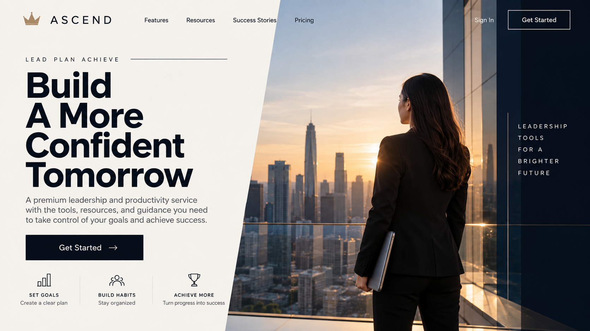
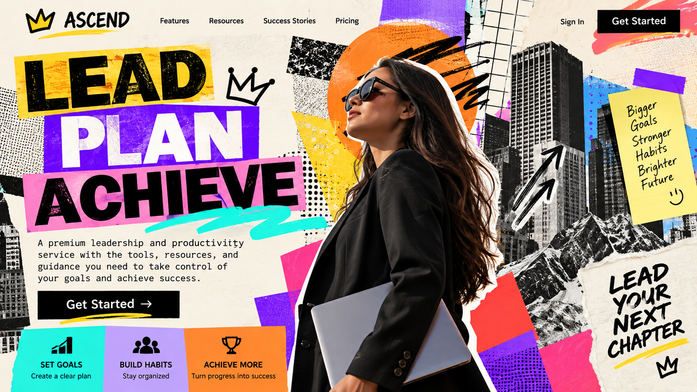

# Ruler

[Home](../README.md)

## Motivation and cues

The Ruler archetype focuses on leadership, control, responsibility, stability, and success. Its audience is often motivated by achievement, status, organization, confidence, and the feeling of being in control.

Visual choices for the Ruler can include strong and professional imagery, organized layouts, bold or sophisticated colors, clear typography, and designs that communicate authority and confidence. Verbal cues can include words such as lead, achieve, control, success, excellence, power, and confidence.

The Ruler archetype works well for brands and organizations connected to luxury products, financial services, professional services, automobiles, technology, and other products or services that emphasize leadership, quality, status, or control.

### Real brand example

**Brand:** Rolex

Rolex can be interpreted through the Ruler archetype because its brand communication emphasizes prestige, achievement, quality, and success. These ideas connect with the Ruler's focus on status, leadership, control, and excellence.

**Direct source:** [Rolex](https://www.rolex.com/)

**My interpretation:** I would adapt this Ruler approach by using confident language, sophisticated imagery, strong typography, and an organized layout. The design should make the audience feel that the brand represents leadership, quality, and achievement.

## Brief

**Audience:** People looking for a premium product or service that represents achievement, confidence, and success.

**Product:** A fictional premium leadership and productivity service.

**Core offer:** Professional tools and personalized resources that help people organize their goals, make confident decisions, and achieve success.

**Action:** Encourage visitors to explore the service and begin using its leadership and productivity resources.

**Modernist style:** International Style

**Postmodernist style:** Postmodern Eclecticism

**Persuasion principle:** Unity

## Hero 1: Modernist / Unity

This hero uses the Ruler archetype through confident messaging, professional imagery, and a strong, organized presentation. The International Style is reflected through the clean layout, clear visual hierarchy, simple typography, and structured placement of information. The persuasion principle of Unity is used by keeping the visual elements consistent and connected, helping the design communicate leadership, confidence, and control.

## Hero 2: Postmodernist / Unity

This hero uses the Ruler archetype through bold imagery, confident messaging, and a strong visual presence. The Postmodern Eclecticism style is reflected through a more expressive composition, bold visual elements, varied shapes, and a less structured arrangement. The persuasion principle of Unity connects the different visual elements so the design still feels consistent and focused on leadership and success.

## Comparison

Both hero designs communicate the Ruler archetype through confident messaging, strong imagery, and a focus on leadership and achievement. The modernist version uses the International Style, making the design feel organized, professional, and controlled. The postmodernist version uses Postmodern Eclecticism, making the design more expressive, bold, and visually dynamic.

For this audience, the modernist approach creates a stronger sense of authority and professionalism because the information is presented clearly with fewer visual distractions. The style changes how the message is presented, while the Ruler archetype and the persuasion principle of Unity keep both designs focused on leadership, confidence, and success.

## Process

I created two original hero designs for the Ruler archetype: one using the International Style and one using Postmodern Eclecticism. I focused on communicating leadership, confidence, achievement, and control while keeping the main message and CTA easy to understand.

For the modernist hero, I used a cleaner and more structured composition with clear hierarchy and organized spacing. For the postmodernist hero, I experimented with a more expressive arrangement, varied visual elements, and a less rigid composition.

During the design process, I revised the layouts to improve readability and make sure the Ruler message remained clear in both styles. I kept the persuasion principle of Unity in mind by making the text, imagery, and other visual elements work together as one connected design.

## Sources and credits

- [Rolex](https://www.rolex.com/) — Ruler brand reference and inspiration.
- International Style research — See [International Style](../international_style.md)
- Postmodern Eclecticism research — See [Postmodern Eclecticism](../postmodern_eclecticism.md)
- Both Ruler hero designs are original designs created for this project.
